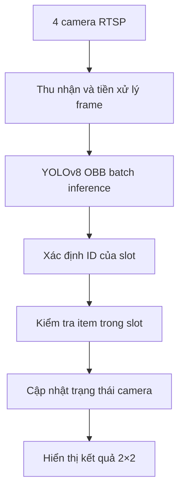

# Ứng dụng Yolo theo dõi việc đóng gói sản phẩm

---

## Yêu cầu công nghiệp:

* Một hộp gồm 2 tầng, mỗi tầng có 5 ô (**slot**) chứa và 5 sản phẩm (**items**) tương ứng. Yêu cầu đặt đúng sản phẩm vào ô tương ứng tại mỗi bước.
* Công việc đóng gói gồm 4 bước, có camera theo dõi mỗi bước.
* Nếu đặt đúng, hiển thị trạng thái **"oke"**, nếu sai thì báo **"false"**.
* 4 cam hoạt động độc lập, song song.

---

## Workflow tổng quan:

* Đọc 4 frame từ camera bằng giao thức RTSP, gửi vào Yolo để lấy kết quả detect.
* Xử lý kết quả từ Yolo để kiểm tra tính hợp lệ của các hành động trung khung hình:

  * Ban đầu, cam ở trạng thái **"waitting"**.
  * Nếu có box vào khung hình, chuyển sang trạng thái **"checking"**.
  * Nếu có item được đặt vào box, check xem đã đặt đúng slot chưa, nếu đúng slot thì hiển thị trạng thái **"oke"**, nếu sai thì hiển thị trạng thái **"wrong"**.
  * Nếu tất cả các slot trong cam đã được đặt đúng, đủ items thì chuyển trạng thái cam sang **"done"**. Nếu có 1 ô sai thì trạng thái cam là **"false"**.
* Hiển thị ra màn hình.

> **Hình ảnh minh hoạ lúc chạy chương trình:**
> 

---

## Kiến trúc hệ thống

Hệ thống được chia thành các thành phần xử lý liên tiếp, bắt đầu từ việc thu nhận hình ảnh của 4 camera và kết thúc bằng việc hiển thị trạng thái đóng gói.

Các module chính của hệ thống:

* `CamThread`: đọc frame liên tục từ từng camera.
* `run.py`: điều phối toàn bộ hệ thống và thực hiện YOLO inference.
* `process_results_from_yolo.py`: xử lý kết quả nhận diện của từng camera.
* `slot_position.py`: xác định ID khi phát hiện đủ 5 slot.
* `predict_slot.py`: dự đoán vị trí và ID của các slot bị thiếu.
* `caculate.py`: thực hiện các phép tính hình học.
* `visual.py`: vẽ kết quả và ghép frame của 4 camera.

### Quy trình đóng gói theo camera

| Camera   | Các slot được kiểm tra | Yêu cầu                                              |
| -------- | ---------------------- | ---------------------------------------------------- |
| Camera 1 | 1, 2, 3                | Đặt 3 `mach_nho`                                     |
| Camera 2 | 1, 2, 3, 4, 5          | Giữ kết quả bước 1, thêm `mach_lon` và `usb_to_jtag` |
| Camera 3 | 6, 7, 8                | Đặt `day_black`, `day_lgbt` và `day_white`           |
| Camera 4 | 6, 7, 8, 9, 10         | Giữ kết quả bước 3, thêm `pack_circut` và `day_gray` |

Camera 2 và Camera 4 kiểm tra cả những sản phẩm đã được đặt ở công đoạn trước. Điều này giúp hệ thống xác nhận toàn bộ tầng hộp đã được đóng gói đúng trước khi kết thúc công đoạn.

### Trạng thái của camera

| Trạng thái | Ý nghĩa                                                |
| ---------- | ------------------------------------------------------ |
| `waiting`  | Camera chưa phát hiện được slot                        |
| `checking` | Hệ thống đang kiểm tra nhưng công đoạn chưa hoàn thành |
| `done`     | Tất cả các slot cần kiểm tra đều chứa đúng sản phẩm    |
| `false`    | Có ít nhất một sản phẩm được đặt sai slot              |

### Trạng thái của slot

| Trạng thái | Ý nghĩa                                        |
| ---------- | ---------------------------------------------- |
| `empty`    | Chưa phát hiện sản phẩm trong slot             |
| `oke`      | Slot chứa đúng loại sản phẩm                   |
| `wrong`    | Slot có sản phẩm nhưng không đúng loại yêu cầu |

---

## Chi tiết một số vấn đề cần giải quyết

### Vị trí, thứ tự của các slot

* Bài toán yêu cầu đặt đúng item vào slot tương ứng, đặt sai là phải phát hiện được. Vấn đề là các slot tương đồng nhau về kích thước, kiểu dáng, nên không thể huấn luyện Yolo detect chi tiết chính xác slot nào là **slot_1**, slot nào là **slot_5** được. Mà hộp lại có thể không cố định vị trị, có thể xoay ngang dọc nên cũng không thể xác định vị trí các slot bằng phương pháp tuyệt đối được, nên phải xác định chúng bằng vị trí tương đối với nhau.

> **Hình minh hoạ cho box:**
> 

* **Ý tưởng thuật toán:** Nhận thấy cả 2 tầng đều có 5 slot, chia thành layout 2 cột. Nên có thể xác định tương đối (3 slot bên trái và 2 slot bên phải).

* **Thực hiện thuật toán:**

  * Đầu tiên, xác định tâm của cả 5 slot, từ đó có thể kẻ 2 đường thẳng: một đi qua 3 slot thẳng hàng và một đi qua 2 slot còn lại.
  * Xác định được **slot_2** là slot ở giữa trong đường thẳng 1.
  * Từ **slot_2**, kẻ 1 vector vuông góc với đường thẳng 1, hướng về đường thẳng 2. Đấy là hướng của layout.
  * Tuỳ thuộc vào toạ độ vector, xác định được **slot_1** và **slot_3** theo định nghĩa sẵn. Sau đó xác định được **slot_4** và **slot_5** luôn.

> **Minh hoạ kết quả thuật toán:**
> 

#### Đầu vào và đầu ra của thuật toán

Đầu vào của thuật toán là 5 OBB tương ứng với 5 slot được Yolo phát hiện. Mỗi OBB gồm 4 điểm xác định phạm vi của slot.

Tâm của mỗi slot được tính bằng cách lấy trung bình tọa độ của 4 đỉnh.

Đầu ra của thuật toán là ID từ `slot_1` đến `slot_5` cùng với tọa độ OBB tương ứng của từng slot.

#### Cách xác định 3 slot thẳng hàng

Với 5 tâm slot, hệ thống lần lượt kiểm tra từng nhóm gồm 3 tâm.

Mỗi nhóm được sử dụng để tạo một đường thẳng xấp xỉ bằng PCA. Sau đó, hệ thống tính tổng khoảng cách từ 3 tâm đến đường thẳng này.

Nhóm có tổng khoảng cách nhỏ nhất được xem là nhóm 3 slot gần thẳng hàng nhất. Hai slot còn lại được xác định là cột thứ hai của layout.

#### Cách xác định hướng của hộp

Trong nhóm 3 slot thẳng hàng, điểm nằm giữa được xác định là `slot_2`.

Từ `slot_2`, hệ thống tạo một vector hướng sang trung tâm của cột chứa 2 slot. Vector này cho biết cột thứ hai đang nằm ở phía nào so với cột thứ nhất.

Dựa vào chiều ngang và chiều dọc của vector, hệ thống xác định hộp đang xoay theo hướng nào trong ảnh. Sau đó, các slot được sắp xếp theo khoảng cách đến một góc tham chiếu phù hợp.

#### Độ phức tạp của thuật toán

Với 5 tâm slot, hệ thống cần kiểm tra 10 nhóm gồm 3 điểm để tìm ra nhóm gần thẳng hàng nhất.

Do số lượng slot luôn cố định bằng 5, số phép tính không tăng theo dữ liệu đầu vào. Vì vậy, thời gian xử lý và lượng bộ nhớ sử dụng của thuật toán đều có thể xem là không đổi.

---

### Vấn đề của thuật toán trên

* Thuật toán trên tuy hoạt động nhanh, chính xác, nhưng có 1 nhược điểm nhỏ là yêu cầu Yolo phải detect đủ 5 slot. Trên thực tế, sẽ có những trường hợp box bị che, hoặc Yolo detect sót, thì phải chuẩn bị phương án backup cho những trường hợp này.

* **Ý tưởng:** là dựa vào những slot đã detect được, dự đoán những slot còn thiếu, sau đó đánh id để xác định slot.

* **Thực hiện thuật toán:**

  * Đầu tiên vẽ map của 2 tầng, khi chạy cam nào thì sẽ dùng map tương ứng với cam đấy.
  * Đưa map vào khớp với box được detect, scale cho kích thước map khớp nhất với hộp.
  * Xoay 4 vòng, kiểm tra xem lần xoay nào vị trí của các slot detect được ít lệch nhất với vị trí của các slot trong map, thì đó là góc xoay đúng.
  * Lấy slot thiếu, id của tất cả các slot áp sang.

> **Minh hoạ kết quả thuật toán:**
> 

---

## Kiểm tra sản phẩm có nằm đúng slot

Sau khi xác định được ID và phạm vi của các slot, hệ thống kiểm tra từng sản phẩm được Yolo phát hiện có nằm trong slot hay không.

Đầu tiên, hệ thống tính diện tích phần giao nhau giữa OBB của sản phẩm và OBB của slot. Sau đó, diện tích phần giao được so sánh với diện tích của sản phẩm và diện tích của slot.

Sản phẩm được xem là nằm trong slot khi thỏa mãn ít nhất một trong hai điều kiện:

* Phần giao chiếm từ 80% diện tích sản phẩm trở lên.
* Phần giao chiếm từ 80% diện tích slot trở lên.

Việc sử dụng hai điều kiện giúp hệ thống xử lý được cả trường hợp OBB của sản phẩm nhỏ hơn slot và trường hợp OBB của sản phẩm lớn hơn slot.

Sau khi xác định sản phẩm nằm trong một slot, hệ thống so sánh tên class của sản phẩm với sản phẩm được quy định cho slot đó:

* Nếu đúng loại sản phẩm, slot chuyển sang trạng thái `oke`.
* Nếu sai loại sản phẩm, slot chuyển sang trạng thái `wrong`.
* Nếu không phát hiện sản phẩm trong slot, slot chuyển sang trạng thái `empty`.

Trạng thái của camera được tổng hợp từ các slot cần kiểm tra:

* Nếu tất cả slot đều có trạng thái `oke`, camera chuyển sang `done`.
* Nếu có ít nhất một slot có trạng thái `wrong`, camera chuyển sang `false`.
* Nếu không có slot sai nhưng vẫn còn slot `empty`, camera giữ trạng thái `checking`.

---

## Xử lý song song và hiển thị kết quả

Mỗi camera được quản lý bởi một `CamThread` riêng. Các thread liên tục đọc frame mới nhất từ camera và lưu lại để vòng lặp chính sử dụng.

Trong mỗi vòng lặp, hệ thống lấy frame mới nhất từ các camera đang hoạt động. Các frame được crop ở chính giữa, resize về cùng kích thước và gom thành một batch trước khi đưa vào Yolo.

Batch inference giúp mô hình xử lý nhiều camera trong một lần gọi thay vì thực hiện inference riêng cho từng camera.

Sau khi nhận kết quả từ Yolo, hệ thống tách riêng kết quả của từng camera. Việc xác định vị trí slot, kiểm tra item và cập nhật trạng thái được thực hiện song song bằng `ThreadPoolExecutor`.

Cuối cùng, các frame đã được vẽ kết quả được ghép thành một lưới 2×2 để theo dõi đồng thời cả 4 công đoạn.
