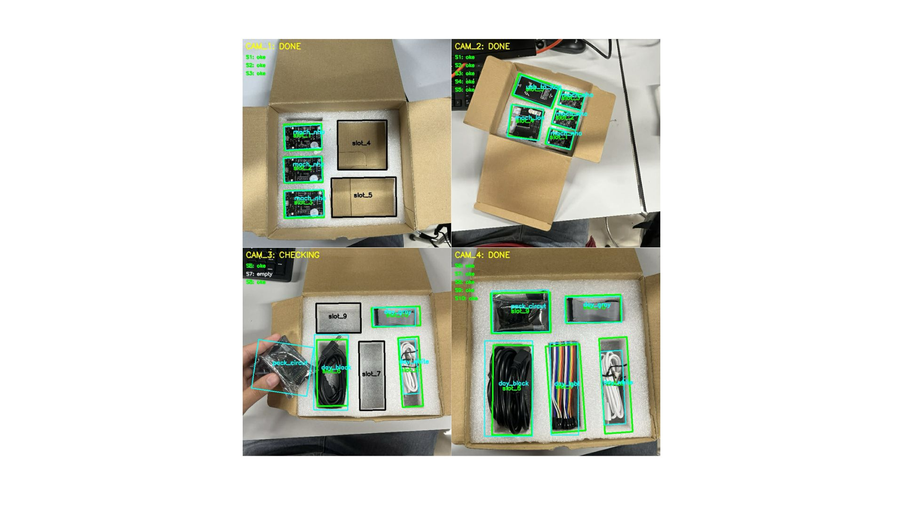
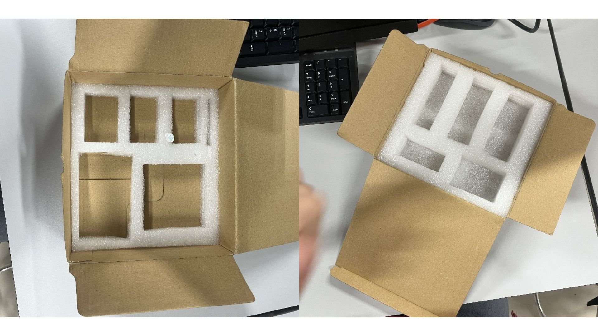
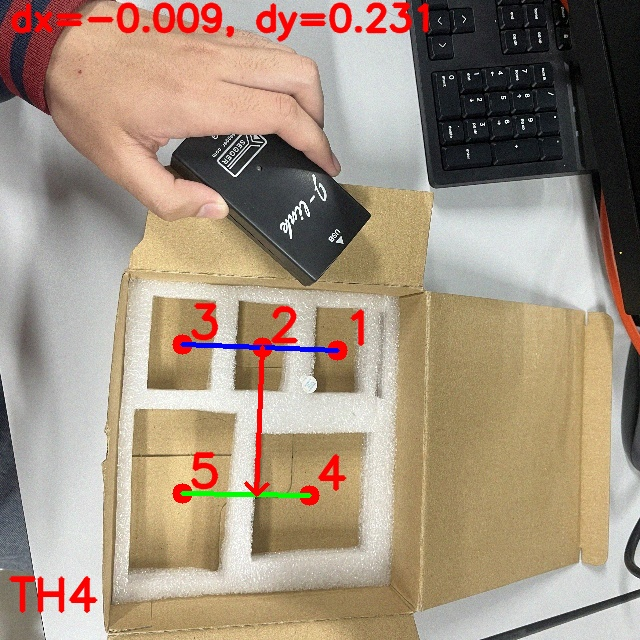
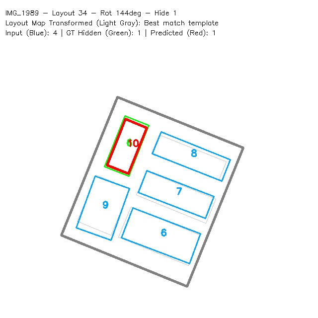

# Ứng dụng Yolo theo dõi việc đóng gói sản phẩm

---

## Yêu cầu công nghiệp:
- Một hộp gồm 2 tầng, mỗi tầng có 5 ô (**slot**) chứa và 5 sản phẩm (**items**) tương ứng. Yêu cầu đặt đúng sản phẩm vào ô tương ứng tại mỗi bước.
- Công việc đóng gói gồm 4 bước, có camera theo dõi mỗi bước.
- Nếu đặt đúng, hiển thị trạng thái **"oke"**, nếu sai thì báo **"false"**.
- 4 cam hoạt động độc lập, song song.

---

## Workflow tổng quan:
- Đọc 4 frame từ camera bằng giao thức RTSP, gửi vào Yolo để lấy kết quả detect.
- Xử lý kết quả từ Yolo để kiểm tra tính hợp lệ của các hành động trung khung hình:
    - Ban đầu, cam ở trạng thái **"waitting"**.
    - Nếu có box vào khung hình, chuyển sang trạng thái **"checking"**.
    - Nếu có item được đặt vào box, check xem đã đặt đúng slot chưa, nếu đúng slot thì hiển thị trạng thái **"oke"**, nếu sai thì hiển thị trạng thái **"wrong"**.
    - Nếu tất cả các slot trong cam đã được đặt đúng, đủ items thì chuyển trạng thái cam sang **"done"**. Nếu có 1 ô sai thì trạng thái cam là **"false"**.
- Hiển thị ra màn hình.

> **Hình ảnh minh hoạ lúc chạy chương trình:**
> 

---

## Chi tiết một số vấn đề cần giải quyết

### Vị trí, thứ tự của các slot
- Bài toán yêu cầu đặt đúng item vào slot tương ứng, đặt sai là phải phát hiện được. Vấn đề là các slot tương đồng nhau về kích thước, kiểu dáng, nên không thể huấn luyện Yolo detect chi tiết chính xác slot nào là **slot_1**, slot nào là **slot_5** được. Mà hộp lại có thể không cố định vị trị, có thể xoay ngang dọc nên cũng không thể xác định vị trí các slot bằng phương pháp tuyệt đối được, nên phải xác định chúng bằng vị trí tương đối với nhau.

> **Hình minh hoạ cho box:**
> 

- **Ý tưởng thuật toán:** Nhận thấy cả 2 tầng đều có 5 slot, chia thành layout 2 cột. Nên có thể xác định tương đối (3 slot bên trái và 2 slot bên phải).

- **Thực hiện thuật toán:**
    - Đầu tiên, xác định tâm của cả 5 slot, từ đó có thể kẻ 2 đường thẳng: một đi qua 3 slot thẳng hàng và một đi qua 2 slot còn lại.
    - Xác định được **slot_2** là slot ở giữa trong đường thẳng 1.
    - Từ **slot_2**, kẻ 1 vector vuông góc với đường thẳng 1, hướng về đường thẳng 2. Đấy là hướng của layout.
    - Tuỳ thuộc vào toạ độ vector, xác định được **slot_1** và **slot_3** theo định nghĩa sẵn. Sau đó xác định được **slot_4** và **slot_5** luôn.

> **Minh hoạ kết quả thuật toán:**
> 

---

### Vấn đề của thuật toán trên
- Thuật toán trên tuy hoạt động nhanh, chính xác, nhưng có 1 nhược điểm nhỏ là yêu cầu Yolo phải detect đủ 5 slot. Trên thực tế, sẽ có những trường hợp box bị che, hoặc Yolo detect sót, thì phải chuẩn bị phương án backup cho những trường hợp này.

- **Ý tưởng:** là dựa vào những slot đã detect được, dự đoán những slot còn thiếu, sau đó đánh id để xác định slot.

- **Thực hiện thuật toán:**
    - Đầu tiên vẽ map của 2 tầng, khi chạy cam nào thì sẽ dùng map tương ứng với cam đấy.
    - Đưa map vào khớp với box được detect, scale cho kích thước map khớp nhất với hộp.
    - Xoay 4 vòng, kiểm tra xem lần xoay nào vị trí của các slot detect được ít lệch nhất với vị trí của các slot trong map, thì đó là góc xoay đúng.
    - Lấy slot thiếu, id của tất cả các slot áp sang.

> **Minh hoạ kết quả thuật toán:**
> 
